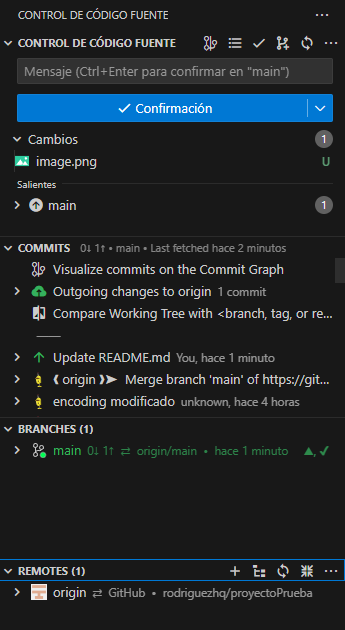

# Proyecto "Biblioteca Web" - Guía de trabajo

Esta guía te ayudará a preparar tu entorno de trabajo y entender cómo colaborar en el proyecto "Biblioteca Web" usando Git y GitHub. Está diseñada para ser fácil de seguir, incluso si nunca has usado Git antes.

Para especificaciones del proyecto, haz click [aquí.](#especificaciones-del-proyecto)

Para problemas durante algun punto del procedimiento, visita la sección de [errores conocidos](#errores-conocidos).

## 1. Preparación del entorno de trabajo

### 1.1. Instalar XAMPP
1. Descarga XAMPP (versión 8.2.12) desde [aquí](https://www.apachefriends.org/es/download.html).
2. Instala XAMPP siguiendo las instrucciones del instalador.
3. Activa las extensiones PHP necesarias:
   - Abre XAMPP y apaga todos los servicios.
   - En "Apache", selecciona "Config" > "PHP (php.ini)".
   - Busca y descomenta (quita el ';' del inicio) las líneas:
     - `extension=zip`
     - `extension=gd`
   - Guarda el archivo y cierra.

### 1.2. Instalar Composer
- Descarga e instala Composer desde [aquí](https://getcomposer.org/Composer-Setup.exe).

### 1.3. Instalar Visual Studio Code
1. Descarga e instala Visual Studio Code desde [aquí](https://code.visualstudio.com/Download).
2. Instala la extensión "Spanish Language Pack" para tener la interfaz en español.
3. Instala las extensiones recomendadas para PHP (IntelliSense y Debugger).

### 1.4. Instalar Git
1. Descarga e instala Git desde [aquí](https://git-scm.com/downloads).
2. (opcional) puedes configurar el editor de git a Visual Studio Code con comando en git bash (si te da algun problema con los permisos ejecuta git bash como administrador)
```
git config --global core.editor "code --wait"
```
4. Abre Git Bash y configura tu identidad:
   ```
   git config --global user.name "Tu Nombre"
   git config --global user.email "tu@email.com"
   ```

## 2. Clonar el repositorio y preparar el proyecto

1. Abre Git Bash y navega a la carpeta donde quieres guardar el proyecto.
2. Clona el repositorio:
   ```
   git clone [URL del repositorio]
   ```
3. Entra en la carpeta del proyecto:
   ```
   cd [nombre-del-proyecto]
   ```
4. Instala las dependencias del proyecto:
   ```
   composer install
   ```
5. Copia el archivo de configuración:
   ```
   cp .env.example .env
   ```
6. Abre el archivo `.env` y configura la conexión a la base de datos:
   ```
   DB_CONNECTION=mysql
   DB_HOST=localhost
   DB_PORT=3306
   DB_DATABASE=laravel
   DB_USERNAME=root
   DB_PASSWORD=
   ```

7. Crea las tablas de la base de datos:
   ```
   php artisan migrate
   ```
8. Esto debería decirte que no encontró la base de datos "laravel" y si quieres crearla, ingresa "yes" y se hará automáticamente, si quieres configurar la base de datos de forma manual:
   - Abre XAMPP y inicia Apache y MySQL.
   - En tu navegador, ve a `localhost/phpmyadmin/`.
   - Crea una nueva base de datos llamada "laravel".
   - corre denuevo el codigo `php artisan migrate`

9. Genera una clave de encriptación:
   ```
   php artisan key:generate
   ```
10. Para llenar tu base de datos local con los libros, dirigete al proyecto `/Script_Subir_Libros/script.ipynb` esto es una notebook de python que subirá los datos a tu base de datos. ejectua la celda 1 (instala la librería necesaria) y la celda 2 (realiza la inserción), la celda 3 es para troubleshooting.
11. Para generar las credenciales por defecto de administrador ejecuta el código siguiente; las credenciales por defecto son "johndoe@example.com" y "password".
```
php artisan db:seed --class=DatabaseSeeder
```

12. Si deseas saber cómo correr la aplicación [haz click aquí](#4-ejecutar-la-aplicación), la siguiente sección hablará como usar GitHub en el dia a dia.
## 3. Trabajar en el proyecto

Esta sección habla de como usar git en el terminal. Si quieres usar [GitHub desktop](https://github.com/apps/desktop)  o la [integración de Visual Studio Code](https://code.visualstudio.com/docs/sourcecontrol/overview) puedes encontrar los tutoriales y links de descarga en el texto resaltado.   

Aquí hablaré de el uso en consolas, ya sea en un terminal de windows o en el terminal integrado de Visual Studio Code (abre el terminal presionando ctrl+ñ).
### 3.1. Crear tu rama personal
1. Asegúrate de estar en la rama principal:
   ```
   git checkout desarrollo
   ```
2. Crea tu rama personal:
   ```
   git checkout -b tu-nombre/feature-que-trabajaras
   ```

### 3.2. Hacer cambios y commits
1. Haz tus cambios en los archivos del proyecto.
2. Añade los cambios para commit:
   ```
   git add .
   ```
3. Haz un commit con un mensaje descriptivo:
   ```
   git commit -m "Descripción breve de los cambios"
   ```

### 3.3. Mantener tu rama actualizada
1. Obtén los últimos cambios del repositorio:
   ```
   git fetch origin
   ```
2. Actualiza tu rama con los cambios de la rama principal:
   ```
   git merge origin/desarrollo
   ```

### 3.4. Subir tus cambios a GitHub
```
git push origin tu-nombre/feature-que-trabajaras
```

### 3.5. Crear un Pull Request
1. Ve a la página del repositorio en GitHub.
2. Haz clic en "Pull requests" y luego en "New pull request".
3. Selecciona tu rama personal como "compare" y la rama de tu grupo como "base".
4. Describe tus cambios y crea el Pull Request.

## 4. Ejecutar la aplicación

1. Inicia Apache y MySQL en XAMPP.
2. En la terminal del proyecto, ejecuta:
   ```
   php artisan serve
   ```
3. Abre tu navegador y ve a la URL que aparece en la terminal.

## 5. Trabajar con versiones anteriores

Git te permite volver a versiones anteriores de tu código, lo cual es muy útil si cometes un error o quieres revisar cambios pasados.

### 5.1. Ver el historial de commits

Para ver el historial de commits en tu rama actual:

```
git log
```

Esto mostrará una lista de commits con sus identificadores (hashes o id), autores, fechas y mensajes. 

### 5.2. Volver a una versión anterior temporalmente

Si quieres revisar una versión anterior sin hacer cambios permanentes:

1. Copia el hash del commit al que quieres volver (los primeros 7 caracteres son suficientes).
2. Ejecuta:
   ```
   git checkout [hash-del-commit]
   ```

Esto te llevará a un estado "desconectado" donde puedes revisar el código antiguo. Para volver a la versión más reciente:

```
git checkout nombre-de-tu-rama
```

### 5.3. Revertir a una versión anterior

Si quieres deshacer cambios y volver a una versión anterior:

1. Encuentra el hash del commit al que quieres volver.
2. Ejecuta:
   ```
   git revert [hash-del-commit]
   ```

Esto creará un nuevo commit que deshace los cambios hasta el punto especificado.

### 5.4. Deshacer cambios en un archivo específico

Si solo quieres deshacer los cambios en un archivo:

```
git checkout -- nombre-del-archivo
```

Esto deshará todos los cambios no commiteados en ese archivo.

### 5.5. Deshacer el último commit (manteniendo los cambios)

Si hiciste un commit por error y quieres deshacerlo, pero manteniendo los cambios para editarlos:

```
git reset --soft HEAD~1
```

Esto deshará el último commit pero mantendrá los cambios en tu área de trabajo.

### 5.6. Restablecer completamente a una versión anterior (¡Usar con precaución!)

Git ofrece una forma de restablecer completamente tu rama a una versión anterior. Este comando es muy poderoso y puede llevar a pérdida de trabajo si no se usa correctamente:
```
git reset --hard <id-del-commit>
```
**¡ADVERTENCIA!** Este comando:

Eliminará todos los commits posteriores al commit especificado.
Eliminará todos los cambios no commiteados en tu directorio de trabajo.
No se puede deshacer fácilmente.

### 5.7. Entender y usar "Force Push"

Un "force push" es una operación en Git que te permite sobrescribir la historia de una rama remota con tu historia local. Es una herramienta poderosa, pero puede ser peligrosa si no se usa correctamente.

Cuándo usar Force Push:

1. Después de usar git reset para eliminar commits que ya habías subido.
2.  Cuando has reescrito la historia local (por ejemplo, con git rebase) y quieres que el remoto refleje estos cambios.
3. En tu rama personal que nadie más está usando.

Cómo hacer un Force Push:
```
git push --force origin nombre-de-tu-rama
```
O una versión más segura:
```
git push --force-with-lease origin nombre-de-tu-rama
```
`--force-with-lease` verifica que no haya cambios en el remoto que no tengas en local antes de hacer el force push, es decir, si el remoto tiene cambios que no tienes no podrás hacer el force push

**Evita usar force push en ramas compartidas, especialmente en `main`, `desarrollo` o `La_rama_de_tu_grupo`. Solo hazlo en tu rama personal**

## Consejos importantes:

- Siempre haz un commit de tus cambios actuales antes de intentar volver a versiones anteriores.
- Si no estás seguro de lo que estás haciendo, consulta con tu Scrum Master o un compañero de equipo con más experiencia en Git.
- Recuerda que si has subido cambios a GitHub y luego los reviertes localmente, tendrás que hacer un "force push" para actualizar GitHub. Ten mucho cuidado con esto, especialmente en ramas compartidas.

Recuerda: Git es una herramienta poderosa, y estas operaciones pueden afectar a tu historial de trabajo. Si no estás seguro de algo, no dudes en pedir ayuda. Con la práctica, te sentirás más cómodo manejando diferentes versiones de tu código.

Recuerda: si tienes dudas en cualquier momento, no dudes en preguntar a tu Scrum Master o a tus compañeros de equipo.

# Especificaciones del proyecto

Aquí hablaremos sobre los detalles del diseño de la pagina, buscando homogenizar el diseño del proyecto.
## Diseño de las interfaces.
En este link puedes ver el diseño de las interfaces de usuario [en este pdf](<./PDF Diseño/INTERFAZ GRÁFICA DE USUARIO “BIBLIOTECA FIS”.pdf>).
## Colores.
Los colores para:

## Tipo de letra.
Los tipos de letra en el diseño son:

# Errores Conocidos
## Problemas con XAMPP
Puede que al inicar el servicio de MySQL u otros en XAMPP te de un error, esto puede ser a 3 cosas:
- Archivos corruptos de XAMPP
- Directorio de XAMPP fuera del scope de la aplicación
- Otra aplicación esta usando el puerto

las 2 primeras se solucionan reinstalando XAMPP en su directorio predefinido (C:/XAMPP) y al momento de instalarlo en una ventana te preguntará si quieres añadir XAMPP al Path, activa esta opcion.

Para la tercera, esto ocurre si tienes MySQL Workspace o similares instalados, cierra estas aplciaciones y todos sus procesos desde el administrador de tareas, si el problema persiste trata de desinstalar estos programas y reiniciar el ordenador.
## Problemas con los comandos `php artisan`
Al momento de ejecutar un comando de php artisan, ya sea como `migrate`, `key:generate`, `install` u otros. 

Antes de cualquier cosa, abre un terminal como administrador y ejecuta:
```
composer -v
```
Para verificar que composer esté instalado y en el Path
```
composer diagnose
```
Para corregir características y archivos.

Luego de ejecutar el `diagnose` debería arreglar los problemas o decirte que problemas tienes. Esto suele ser por:
1. Problemas con XAMPP

Los problemas con XAMPP pueden empezar al instalar composer, cuando pide una dirección del directorio de XAMPP y no lo encuantra, esto es porque instalaste XAMPP en otro lugar que no es el predeterminado, reinstala XAMPP en su dirección predeterminada y reinstala composer.

2. Falta de las extensiones necesarias de php

Este error es porque no tienes las extensiones `zip` habilitadas, en el `diagnose` te mostratá al final que no esta habilitado el extractor de *zip*, para arreglar eso:
   - Abre XAMPP
   - cierra todos los servicios
   - En "Apache" presiona "config" y en el desplegable selecciona "PHP(php.ini)"
   - En el archivo de texto busca (ctrl+b) `;extension=zip` y borra el `;` delante de `extension=zip`, haz  lo mismo con `;extension=gd`.
   - Guarda y cierra el archivo de texto.

Esto debería arreglar ese problema.

3. Instalación incorrecta de composer

Si `composer diagnose` no arregló los archivos, una reinstalación completa de composer debería arreglarlo todo, ejecuta el instalador como administrador.

## Problemas con git

Al abrir `Git bash` y tratar de ingresar algún comando de `config` o ejecutar algun comando `git clone`, `git commit` o similares te da algun error de credenciales o te menciona que no puede acceder al archivo config, esto es por exactamente eso, no hay credenciales o no puede acceder al archivo config (xd).
- No hay credenciales

Para añadir  tus credenciales abre `git bash` y escribe:
```
git config --global user.name "Tu Nombre"
git config --global user.email "tu@email.com"
```
ahí van tu usuario de GitHub y tu correo de GitHub, si al ingresar esto te da un error. prueba el siguiente paso:

- No puede acceder al archivo config

Ejecuta Git Bash como administrador para realizar la configuración de credenciales

- GitHud Desktop da un error al iniciar

Para problemas específicos de GitHub Desktop visita: [GitHub Desktop Issues](https://github.com/desktop/desktop/issues) y busca el mensaje de error.
